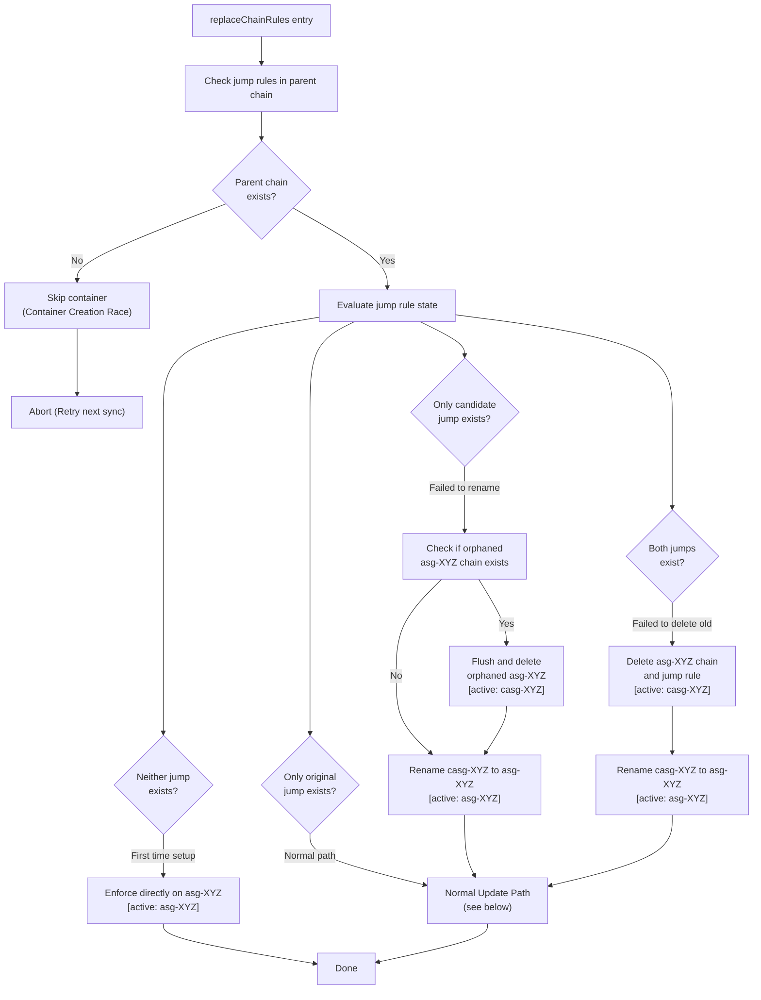
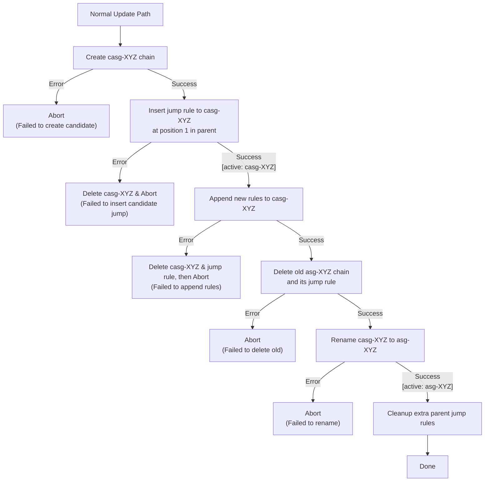

<!-- vim-markdown-toc GFM -->

* [VXLAN Policy Agent Enforcement Cycle](#vxlan-policy-agent-enforcement-cycle)
  * [Overview](#overview)
  * [Naming Conventions](#naming-conventions)
  * [replaceChainRules Decision Tree](#replacechainrules-decision-tree)
  * [State-by-State Walkthrough](#state-by-state-walkthrough)
    * [Neither exists](#neither-exists)
    * [Only original exists](#only-original-exists)
    * [Only candidate exists (Scenario 1 recovery)](#only-candidate-exists-scenario-1-recovery)
    * [Both exist (Scenario 2 recovery)](#both-exist-scenario-2-recovery)
  * [Failure Scenarios Prevented](#failure-scenarios-prevented)
  * [Normal Update Path Detail](#normal-update-path-detail)

<!-- vim-markdown-toc -->

# VXLAN Policy Agent Enforcement Cycle

## Overview

The `vxlan-policy-agent` periodically polls the policy server for Application Security Group (ASG) rules and enforces them on the host using `iptables`. To ensure that network traffic is not interrupted or dropped during rule updates, the agent uses a "candidate and rename" strategy. Instead of modifying the active chain directly, it builds a new "candidate" chain, inserts a jump rule to it, and then swaps it into place by deleting the old chain and renaming the new one.

This document explains the decision tree in the `replaceChainRules` function, which is responsible for this atomic swap and for recovering from partial failures if the agent crashes mid-update.

## Naming Conventions

- **Original / Active Chain (`asg-XYZ`)**: The chain currently serving traffic for a container. `XYZ` is derived from the container handle.
- **Candidate Chain (`casg-XYZ`)**: A temporary chain built during an update to hold the new rules.
- **Jump Rule**: A rule in the parent chain (e.g., `netout-XYZ`) that directs traffic into the ASG chain (e.g., `-A netout-XYZ -j asg-XYZ`). The presence of a jump rule determines whether a chain is actively evaluating traffic.

## replaceChainRules Decision Tree

The `replaceChainRules` function begins by checking the parent chain for jump rules pointing to either the original chain or the candidate chain. Based on what it finds, it determines the current state and how to proceed.



## State Evaluation and Recovery

The following table details the four possible states detected by `replaceChainRules`, the recovery actions taken, and why those actions are safe for the running application's traffic.

| State / Failure Mode | Jump Rules Found | Recovery Action | Active Chain (Latest-known-good) | Why it is Safe |
| :--- | :--- | :--- | :--- | :--- |
| **First-time Setup** | Neither | Enforce directly on `asg-XYZ` (create chain, append rules, insert jump). | `asg-XYZ` | No existing traffic or rules to disrupt. |
| **Normal Update** | Only `asg-XYZ` | Build `casg-XYZ`, insert jump, delete `asg-XYZ` jump & chain, rename `casg-XYZ` -> `asg-XYZ`. | `asg-XYZ` -> `casg-XYZ` -> `asg-XYZ` | The new rules are fully built in `casg-XYZ` before its jump rule is inserted at position 1. Traffic seamlessly shifts to the new rules before the old chain is deleted. |
| **Container Creation Race (Parent chain not ready)** | N/A (Check fails) | Skip container enforcement. Retry on next sync cycle. | None | The container's network interface (and parent chain) is still being created by the CNI plugin. No application traffic can escape the container until the parent chain is wired up, so skipping enforcement temporarily does not leak traffic. |
| **Interrupted Update (Failed to create candidate)** | Only `asg-XYZ` | Normal update path retries. | `asg-XYZ` | The original chain and jump rule were never modified. Traffic continues to flow through the old rules uninterrupted. |
| **Interrupted Update (Failed to insert candidate jump)** | Only `asg-XYZ` | Normal update path retries. Agent attempts to delete the orphaned candidate chain during the failure. | `asg-XYZ` | The parent chain was never successfully modified to point to the candidate. Traffic continues through the original chain. |
| **Interrupted Update (Failed to append rules)** | Only `asg-XYZ` (if immediate cleanup succeeds) or Both (if cleanup fails) | Normal update or "Both exist" recovery. | `asg-XYZ` (if cleanup succeeds) or `casg-XYZ` (if cleanup fails) | The agent immediately attempts to delete the candidate chain and jump rule to revert traffic to the original chain. If this cleanup fails, it falls into the "Both exist" recovery state on the next sync. |
| **Interrupted Update (Failed to rename)** | Only `casg-XYZ` | Flush/delete orphaned `asg-XYZ` chain, rename `casg-XYZ` -> `asg-XYZ`, run normal update. | `casg-XYZ` | The candidate chain contains the fully built ruleset from the previous run. Renaming it restores the standard naming convention without dropping traffic. Clearing the orphaned chain prevents `RenameChain` failures (indefinite loop bug). |
| **Interrupted Update (Failed to delete old)** | Both | Delete `asg-XYZ` chain & jump, rename `casg-XYZ` -> `asg-XYZ`, run normal update. | `casg-XYZ` | `casg-XYZ` was inserted at position 1, so it is already actively evaluating traffic with the newer rules. Deleting the old chain safely cleans up unused rules and prevents traffic from falling back to old rules (traffic regression bug). |

## Normal Update Path Detail

When the agent executes a normal update (starting from "Only original exists" or after recovering from a partial failure), it follows these steps:



## Happy Path iptables Examples

The following examples show the state of the `iptables` rules for a container (handle `abc123def456`) at each step of its lifecycle, from initial creation by the CNI plugin to a successful ASG update by the `vxlan-policy-agent`.

### 1. CNI netrules create
The CNI plugin creates the parent chain (`netout-abc123def456`) and adds default rules to allow established connections and reject everything else. The ASG chain does not exist yet.

```iptables
-N netout-abc123def456
-A netout-abc123def456 -m state --state RELATED,ESTABLISHED -j ACCEPT
-A netout-abc123def456 -j REJECT --reject-with icmp-port-unreachable
```

### 2. CNI force asg (Initial enforcement)
The CNI plugin calls the `vxlan-policy-agent` to force an immediate ASG sync. The agent creates the `asg-abc123def456` chain, populates it with the initial rules, and inserts a jump rule at position 1 in the parent chain.

```iptables
-N asg-abc123def456
-A asg-abc123def456 -d 10.0.0.0/8 -p tcp -m tcp --dport 80 -j ACCEPT
-N netout-abc123def456
-A netout-abc123def456 -j asg-abc123def456
-A netout-abc123def456 -m state --state RELATED,ESTABLISHED -j ACCEPT
-A netout-abc123def456 -j REJECT --reject-with icmp-port-unreachable
```

### 3. vxlan-policy-agent updating (new chain created)
During a periodic sync, the agent detects a rule change. It creates a new candidate chain (`casg-abc123def456`). The original chain is still active.

```iptables
-N asg-abc123def456
-A asg-abc123def456 -d 10.0.0.0/8 -p tcp -m tcp --dport 80 -j ACCEPT
-N casg-abc123def456
-N netout-abc123def456
-A netout-abc123def456 -j asg-abc123def456
-A netout-abc123def456 -m state --state RELATED,ESTABLISHED -j ACCEPT
-A netout-abc123def456 -j REJECT --reject-with icmp-port-unreachable
```

### 4. vxlan-policy-agent updating (new jump inserted & rules appended)
The agent inserts a jump rule to the candidate chain at position 1 in the parent chain, and appends the new rules to the candidate chain. Traffic now flows through the candidate chain.

```iptables
-N asg-abc123def456
-A asg-abc123def456 -d 10.0.0.0/8 -p tcp -m tcp --dport 80 -j ACCEPT
-N casg-abc123def456
-A casg-abc123def456 -d 10.0.0.0/8 -p tcp -m tcp --dport 443 -j ACCEPT
-N netout-abc123def456
-A netout-abc123def456 -j casg-abc123def456
-A netout-abc123def456 -j asg-abc123def456
-A netout-abc123def456 -m state --state RELATED,ESTABLISHED -j ACCEPT
-A netout-abc123def456 -j REJECT --reject-with icmp-port-unreachable
```

### 5. vxlan-policy-agent updating (remove old jump rule)
The agent deletes the jump rule pointing to the original `asg-abc123def456` chain.

```iptables
-N asg-abc123def456
-A asg-abc123def456 -d 10.0.0.0/8 -p tcp -m tcp --dport 80 -j ACCEPT
-N casg-abc123def456
-A casg-abc123def456 -d 10.0.0.0/8 -p tcp -m tcp --dport 443 -j ACCEPT
-N netout-abc123def456
-A netout-abc123def456 -j casg-abc123def456
-A netout-abc123def456 -m state --state RELATED,ESTABLISHED -j ACCEPT
-A netout-abc123def456 -j REJECT --reject-with icmp-port-unreachable
```

### 6. vxlan-policy-agent updating (remove old chain)
The agent flushes and deletes the original `asg-abc123def456` chain.

```iptables
-N casg-abc123def456
-A casg-abc123def456 -d 10.0.0.0/8 -p tcp -m tcp --dport 443 -j ACCEPT
-N netout-abc123def456
-A netout-abc123def456 -j casg-abc123def456
-A netout-abc123def456 -m state --state RELATED,ESTABLISHED -j ACCEPT
-A netout-abc123def456 -j REJECT --reject-with icmp-port-unreachable
```

### 7. vxlan-policy-agent updating (rename new chain to old chain)
The agent renames `casg-abc123def456` to `asg-abc123def456`. The jump rule in the parent chain is automatically updated by `iptables` to reflect the new name. The update is complete.

```iptables
-N asg-abc123def456
-A asg-abc123def456 -d 10.0.0.0/8 -p tcp -m tcp --dport 443 -j ACCEPT
-N netout-abc123def456
-A netout-abc123def456 -j asg-abc123def456
-A netout-abc123def456 -m state --state RELATED,ESTABLISHED -j ACCEPT
-A netout-abc123def456 -j REJECT --reject-with icmp-port-unreachable
```