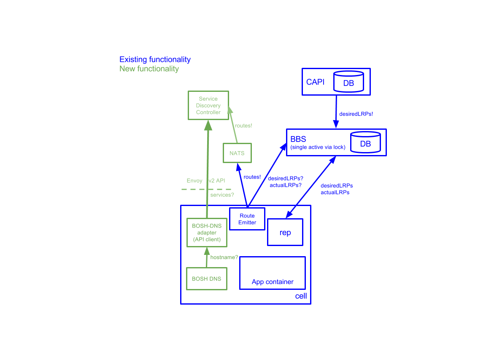

# CF App Service Discovery (EXPERIMENTAL)

- [High Level Overview](#high-level-overview)
    - [Problem we are trying to solve](#problem-we-are-trying-to-solve)
    - [App Developer Experience](#app-developer-experience)
    - [Interaction with Policy](#interaction-with-policy)
    - [Internal domain creation](#internal-domain-creation)
    - [Example usage](#example-usage)
- [Architecture](#architecture)
    - [Architecture Diagram](#architecture-diagram)
- [Deployment Instructions](#deployment-instructions)
    - [BOSH-lite](#bosh-lite)
    - [Experimental Ops File for cf-deployment](#experimental-ops-file-for-cf-deployment)
- [Logging](#logging)
    - [Debugging problems](#debugging-problems)
- [Metrics](#metrics)
- [Tests](#tests)
    - [Unit](#unit)
    - [Smoke](#smoke)
    - [Acceptance](#acceptance)

## High Level Overview

### Problem we are trying to solve
Application Developers who want to use container to container networking today are required to bring their own service discovery. While we have provided examples with Eureka and Amalgam8, we have received user feedback that usage of c2c is very difficult, with some common themes emerging:
* Polyglot microservices written in languages/frameworks other than Java/Spring cannot easily use Eureka
* Clustering applications have a requirement to address individual instances
* Additional VMs need to be deployed and managed to provide external service discovery

In order to support all types of apps, languages and frameworks, we plan to build service discovery for c2c into the platform. With this feature, users will no longer have to bring their own service discovery. 

### App Developer Experience

You can run `map-route` with the internal domain to create and map an internal route for your app.

### Interaction with Policy

By default, apps cannot talk to each other over cf networking. In order for an app to talk to another app, you must still set a policy allowing access. 

### Internal domain creation

With capi-release versions 1.49.0-1.60.0:

- The internal domain `apps.internal` is automatically created for you. 

With capi-release versions >= 1.61.0:

- The `apps.internal` internal domain is no longer seeded and must be created using the CAPI api. See the [Example steps](#example-steps) section for instructions.
- A custom domain name may be used when creating an internal domain name, but note that the bosh-dns-adapter job's `internal_domains` property must be updated too. The default value for this property is 'apps.internal'.

### Example usage

For example usage, please reference our [repo of example apps](https://github.com/cloudfoundry/cf-networking-examples).

## Architecture

### Architecture Diagram


## Deployment Instructions

Enable local DNS on your `bosh` director as specified [here](https://bosh.io/docs/dns.html).

### BOSH-lite

Run the [`scripts/deploy-to-bosh-lite`](scripts/deploy-to-bosh-lite) script.

To deploy you will need [cf-networking-release](https://github.com/cloudfoundry/cf-networking-release), [bosh-deployment](https://github.com/cloudfoundry/bosh-deployment), and [cf-deployment](https://github.com/cloudfoundry/cf-deployment).

### All other platforms

To add service discovery to cf-deployment, include the following experimental ops-files:
- [Service Discovery ops file](https://github.com/cloudfoundry/cf-deployment/blob/release-candidate/operations/experimental/enable-service-discovery.yml)
- [BOSH DNS ops file](https://github.com/cloudfoundry/cf-deployment/blob/release-candidate/operations/experimental/use-bosh-dns.yml)
- [BOSH DNS for containers ops file](https://github.com/cloudfoundry/cf-deployment/blob/release-candidate/operations/experimental/use-bosh-dns-for-containers.yml)

#### Example steps 
***Assumes you're running a recent environment from cf-deployment***
* Pull down your current manifest with 
```
bosh manifest > /tmp/cf-manifest.yml
```

* Create an internal domain.
Note: this step may not be neccessary if service discovery was already enabled.
CAPI previously seeded the `apps.internal` domain. As of CAPI 1.61.0, the `apps.internal` domain is no longer seeded in the database.
Fresh installs need to run the following command:
```
cf curl /v2/shared_domains -d '{
  "name": "apps.internal",
  "internal": true
}'
```

* Use the following command to list the domains, and to verify which of the domains are `'internal': true`
```
cf curl /v2/shared_domains
```

* Update the `internal_domains` job property on the `bosh-dns-adapter` job if the internal domain is not `apps.internal`. The list of
domains should match the internal domains that have been configured in the prior step.
The `internal_domains` job property defaults to `['apps.internal']`.

* Update your deployment with the ops files
``` bash
bosh deploy /tmp/cf-manifest.yml \
  -o ~/workspace/cf-deployment/operations/experimental/use-bosh-dns-for-containers.yml \
  -o ~/workspace/cf-deployment/operations/experimental/use-bosh-dns.yml \
  -o ~/workspace/cf-deployment/operations/experimental/enable-service-discovery.yml \
  --vars-store path/to/vars-store.yml
  # The --var-store flag will cause cli variable generation, and
  # your secrets will be stored in the supplied file path. This is probably not what you 
  # want. Read more here: https://bosh.io/docs/cli-int.html#vars-store
```

## Logging

### Debugging problems

* To change logging for service-discovery-controller, ssh onto the VM holding the service-discovery-controller and make a request to the log-level server:
```bash
curl -X POST -d 'debug' localhost:8055/log-level
```
where `8055` is the default value of `log_level_port`.

To switch back to `info` logging:
```bash
curl -X POST -d 'info' localhost:8055/log-level
```

* To change logging for bosh-dns-adapter, ssh onto the VM holding the bosh-dns-adapter and make a request to the log-level server:
```bash
curl -X POST -d 'debug' localhost:8066/log-level
```

To switch back to `info` logging:
```bash
curl -X POST -d 'info' localhost:8066/log-level
```


## Metrics

`bosh_dns_adapter.GetIPsRequestTime` - duration of get ip request in nanoseconds
`bosh_dns_adapter.GetIPsRequestCount` - number of get ip requests
`bosh_dns_adapter.DNSRequstFailures` - number of failed requests to the Service Discovery Controller
`bosh_dns_adapter.uptime` - process uptime, emitted on 10 second interval
`service_discovery_controller.RegistrationRequestTime` - duration of registration request in nanoseconds
`service_discovery_controller.RegistrationRequestCount` - number of registration requests
`service_discovery_controller.addressTableLookupTime` - duration of looking up address table in nanoseconds
`service_discovery_controller.uptime` - process uptime, emitted on 10 second interval
`service_discovery_controller.dnsRequest` - count of successful dnsRequests, emitted on a 10 second interval
`service_discovery_controller.registerMessagesReceived` - count of route register messages received via NATS from route emitter
`service_discovery_controller.maxRouteMessageTimePerInterval` - maximum time taken from BBS to SDC, only on new app creation

To deploy a firehose nozzle to see the metrics, upload the
[datadog-firehose-nozzle-release](http://bosh.io/releases/github.com/DataDog/datadog-firehose-nozzle-release)
and follow the instructions
[here](https://github.com/DataDog/datadog-firehose-nozzle-release) to deploy.

## Tests

### Unit
Unit tests should be run if making a PR or changes to the repo.
```bash
./scripts/docker-test
```

### Smoke
Smoke tests can be run periodically against live environments to check basic service discovery remains functional.

You must set the environment variable `$CONFIG`
which points to a JSON file
that contains several pieces of data
that will be used to configure the acceptance tests,
e.g. telling the tests how to target
your running Cloud Foundry deployment
and what tests to run.

The following can be pasted into a terminal
and will set up a sufficient `$CONFIG`
to run the core test suites
against a [BOSH-Lite](https://github.com/cloudfoundry/bosh-lite)
deployment of CF.

```bash
cat > integration_config.json <<EOF
{
  "api": "api.bosh-lite.com",
  "apps_domain": "bosh-lite.com",
  "admin_user": "admin",
  "admin_password": "admin",
  "prefix": "smoke-test-",
  "smoke_org": "smoke_org",
  "smoke_space": "smoke_space"
}
EOF
export CONFIG=$PWD/integration_config.json
```

#### The full set of config parameters is explained below:
##### Required parameters:
* `api`: Cloud Controller API endpoint.
* `admin_user`: Name of a user in your CF instance with admin credentials.  This admin user must have the `network.admin` scope.
* `admin_password`: Password of the admin user above.
* `prefix`: Prefix for apps, orgs, and spaces created as part of the smoke tests

##### Optional parameters:
* `smoke_org`: Name of pre-existing org for smoke test
* `smoke_space`: Name of pre-existing space for smoke test

Once the config is set, to run the smoke tests do the following
```bash
ginkgo -r ./src/test/smoke-sd
```

### Acceptance
Acceptance tests should be run to see that service discovery is still functional at a CF level.

#### Running the full acceptance test on bosh-lite
```bash
./scripts/test-sd-acceptance-local
```

#### Running the full acceptance test on specific env
You must set the environment variable `$CONFIG`
which points to a JSON file
that contains several pieces of data
that will be used to configure the acceptance tests,
e.g. telling the tests how to target
your running Cloud Foundry deployment
and what tests to run.

The following can be pasted into a terminal
and will set up a sufficient `$CONFIG`
to run the core test suites
against a [BOSH-Lite](https://github.com/cloudfoundry/bosh-lite)
deployment of CF. `admin-password` and `admin-secret` need to be replaced
with proper values.

```bash
cat > integration_config.json <<EOF
{
  "api": "api.bosh-lite.com",
  "admin_user": "admin",
  "admin_password": "{{admin-password}}",
  "admin_secret": "{{admin-secret}}",
  "apps_domain": "bosh-lite.com",
  "skip_ssl_validation": true,
}
EOF
export CONFIG=$PWD/integration_config.json
```

#### The full set of config parameters is explained below:
##### Required parameters:
* `api`: Cloud Controller API endpoint.
* `admin_user`: Name of a user in your CF instance with admin credentials.  This admin user must have the `network.admin` scope.
* `admin_password`: Password of the admin user above.
* `admin_secret`: Secret of the admin user above.
* `apps_domain`:  A shared domain that tests can use to create subdomains that will route to applications also created in the tests.
* `skip_ssl_validation`:  Set to true if using an invalid (e.g. self-signed) cert for traffic routes to your CF instances;
this is generally always true for BOSH-Lite deployments of CF.

Once the config is set, to run the acceptance tests do the following
```bash
ginkgo -r ./src/test/acceptance-sd
```
