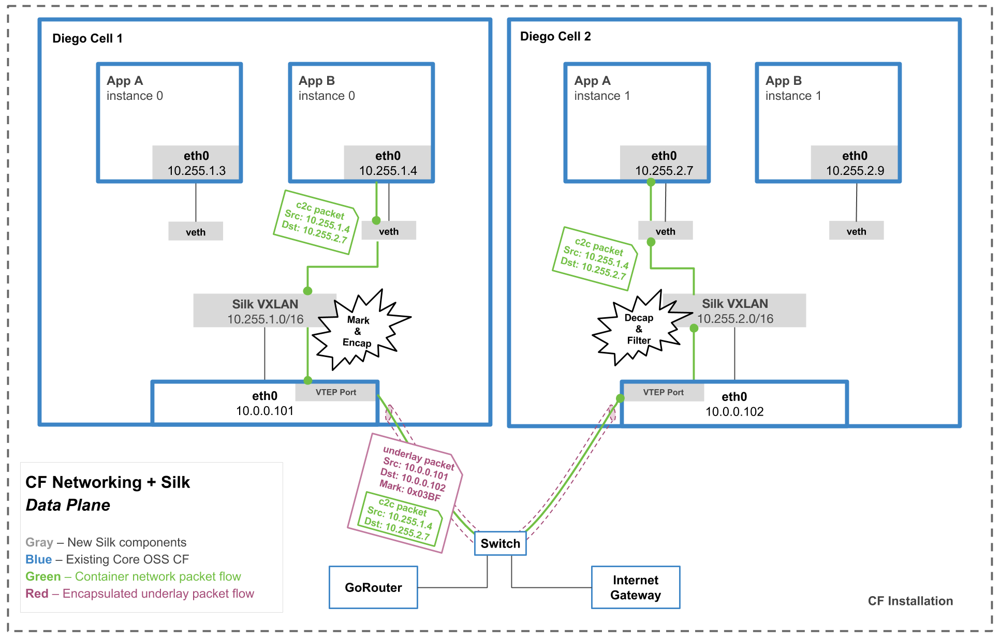
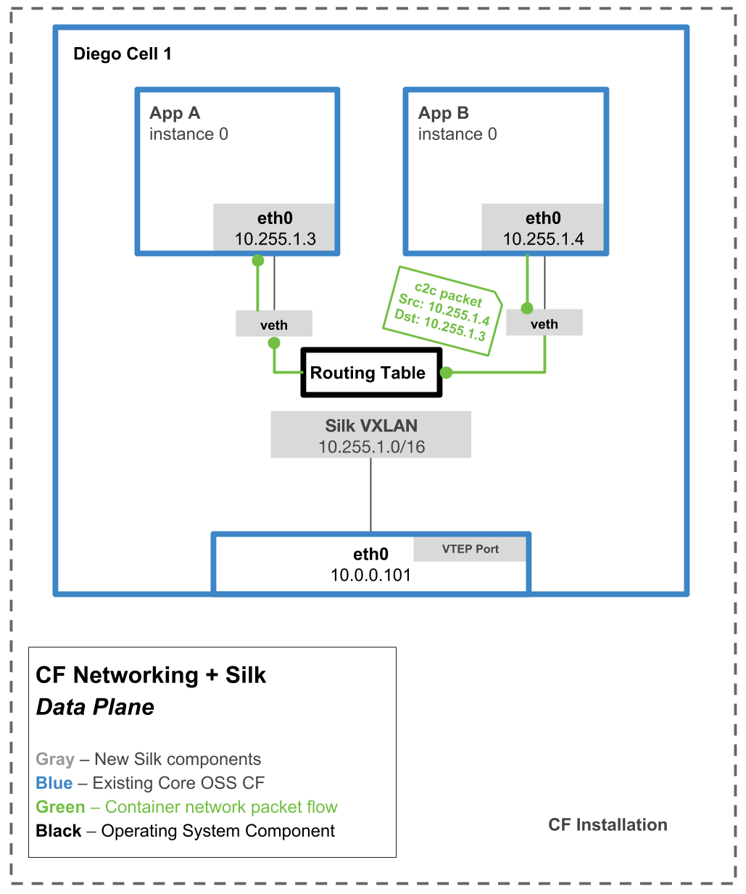
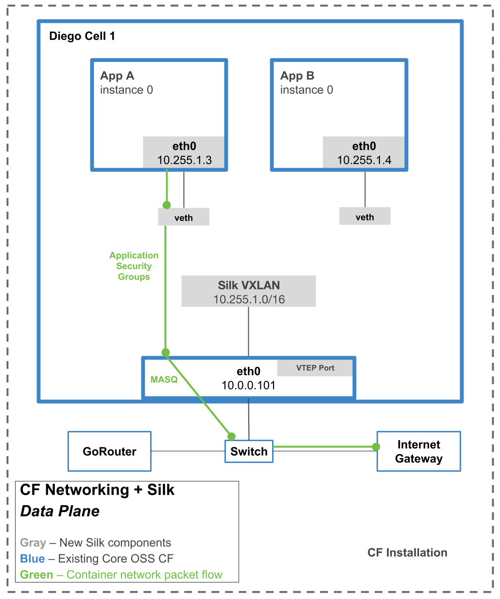
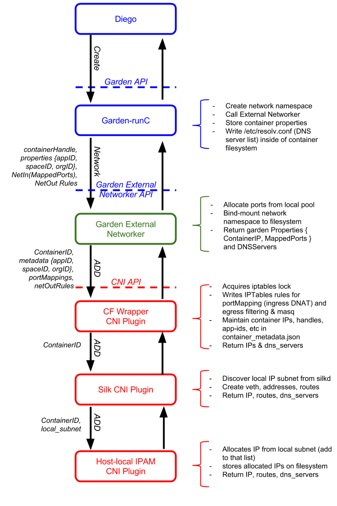

# Architecture

CF Networking provides policy-driven container networking for Cloud Foundry.

CF Networking has several components.  Some are "core" to the Cloud Foundry platform, others are "swappable" by operators who wish to use a 3rd party network system instead.
For more information on integrating a 3rd-party networking solution, [see here](3rd-party.md).

### Core components
- Policy Server, a central management node, exposes a JSON REST API used by the CLI plugin
- [Garden External Networker](../src/garden-external-networker), a [Garden-runC](https://github.com/cloudfoundry/garden-runc-release) add-on deployed to every Diego cell
  - Invokes an operator-configured [CNI](https://github.com/containernetworking/cni) Plugin to set up the network for each app instance (container)
  - Forwards ports to support incoming connections from the CF [HTTP Router](https://docs.cloudfoundry.org/concepts/http-routing.html),
    [TCP Router](https://docs.cloudfoundry.org/adminguide/enabling-tcp-routing.html) and [Diego SSH Proxy](https://docs.cloudfoundry.org/concepts/diego/ssh-conceptual.html).

### Batteries included, but swappable
On every Diego cell
- [Silk](https://github.com/cloudfoundry-incubator/silk), provides IP address management and network connectivity to app instances (containers)
  - Uses a [VXLAN overlay](data_plane.png) for sending traffic between cells
  - Every CF app instance gets a unique IP on a shared, flat L3 network
- VXLAN Policy Agent enforces network policy for network traffic between applications
  - Discovers desired network policies from the [Policy Server's Internal API](3rd-party.md#policy-server-internal-api)
  - Updates IPTables rules on Diego cell to allow whitelisted ingress traffic
  - Egress traffic is tagged with a unique identifier per source application, using the [VXLAN GBP header](https://tools.ietf.org/html/draft-smith-vxlan-group-policy-02#section-2.1)
  - Optionally [limit bandwidth](bandwidth-limiting.md) in and out of each container
- Traffic within a diego cell travels in the overlay network. Traffic going to the internet or other diego cells travels in the underlay network.

 

### Plugin layer cake
Here is a summary of the network-related actions that occur when a new container is created.

