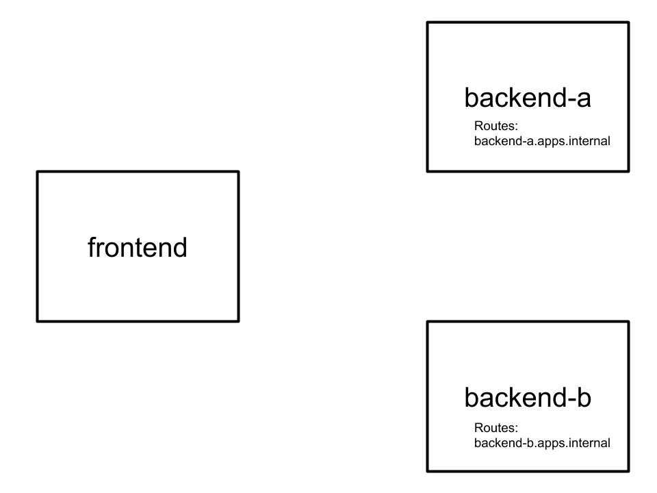
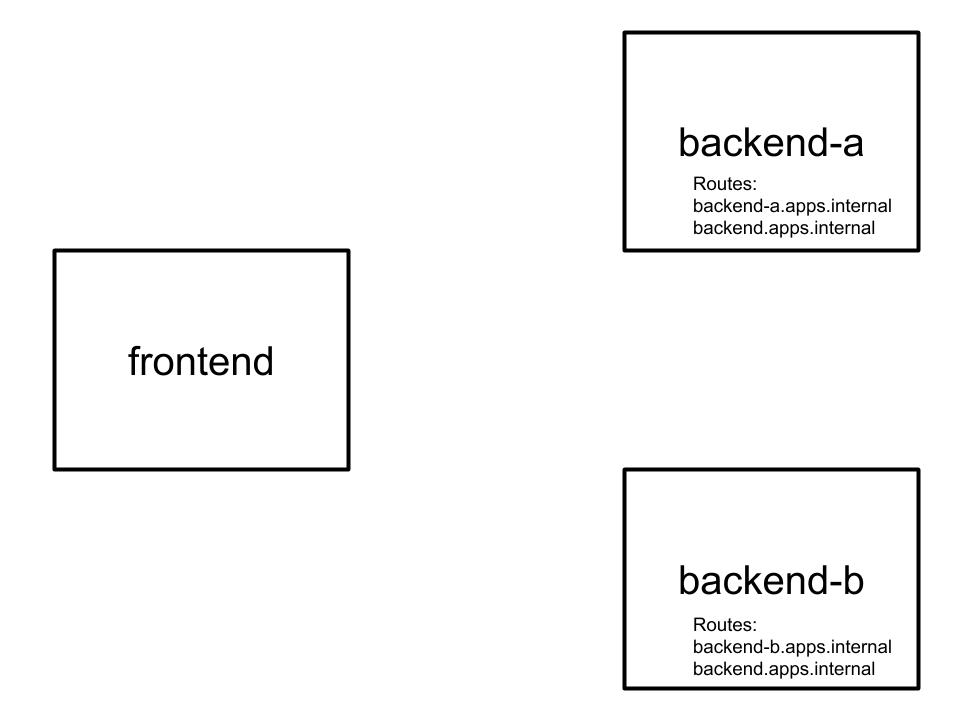
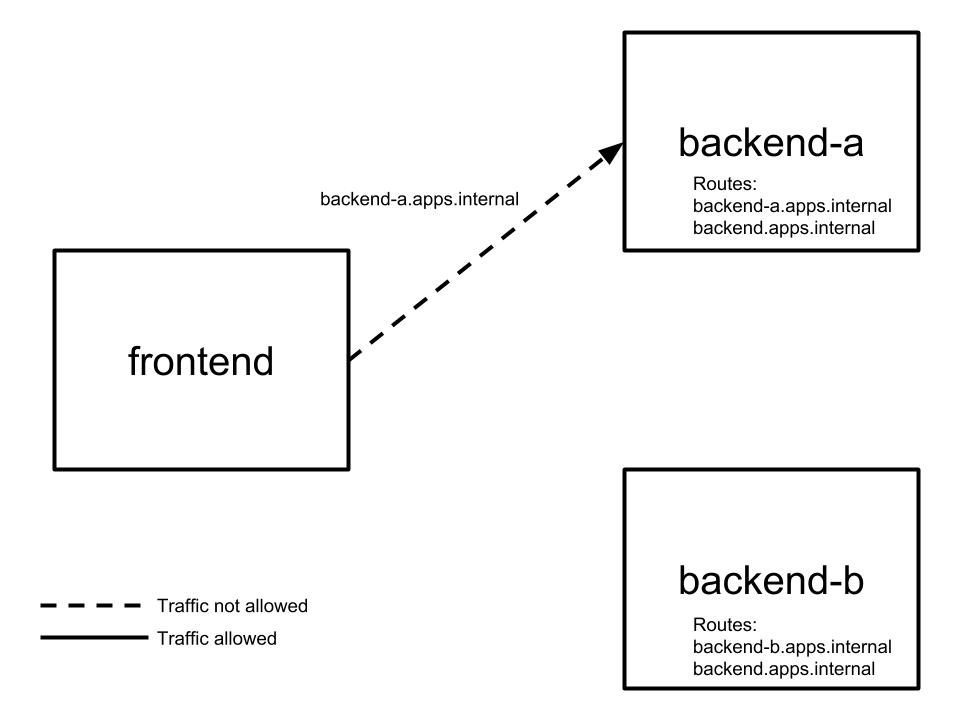
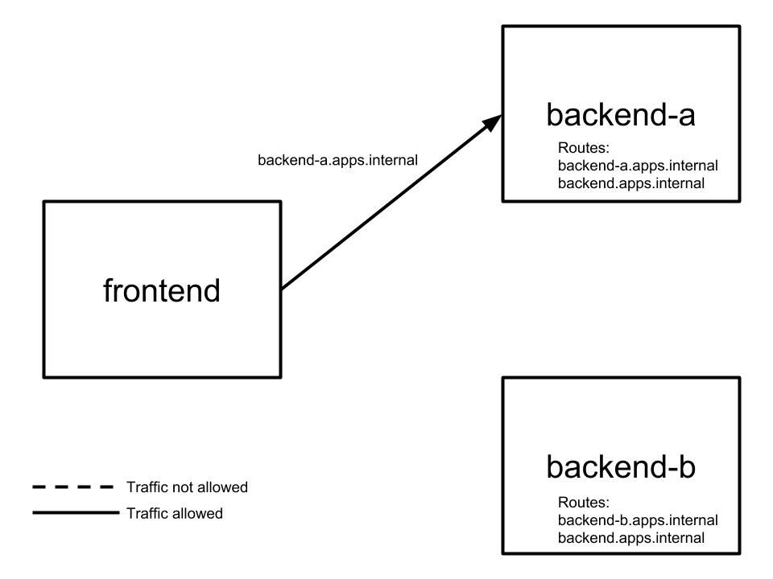
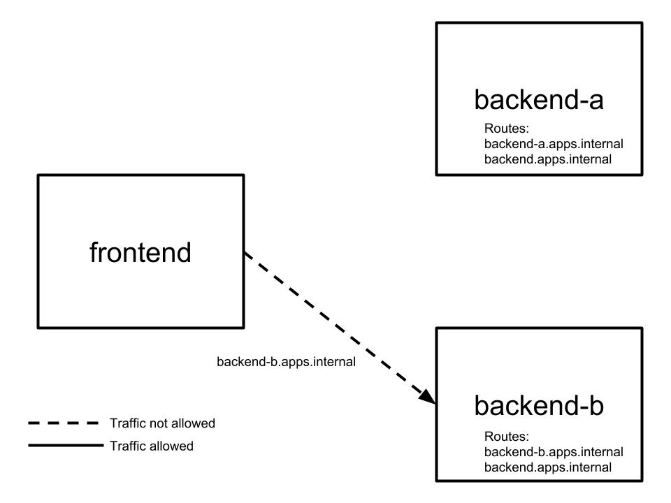
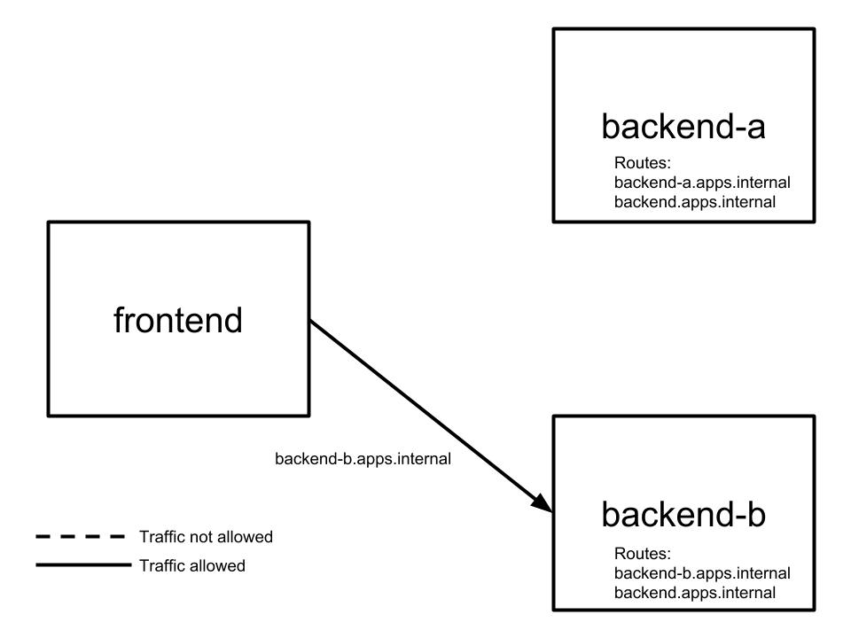
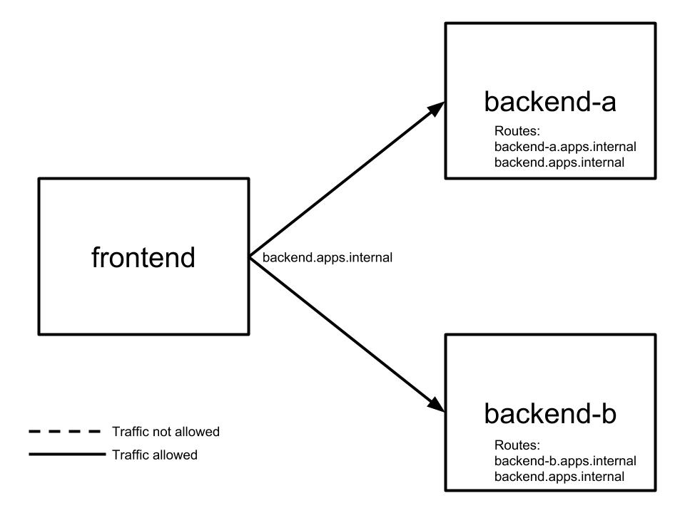

# Cats and Dogs with Service Discovery Diagrams

Below is a visual representation of the steps taking place with the cats and dogs with service discovery demo app.

### (1) Pushing frontend and backends with individual internal routes

  

### (2) Creating internal route shared by both backends

  

### (3) Trying to connect to backend-a specifically without a policy configured

  

### (4) Connecting to backend-a specifically with policy configured

  

### (5) Trying to connect to backend-b specifically without a policy configured

  

### (6) Connecting to backend-b specifically with policy configured

  

### (7) Connecting to both backends when each has a policy configured

  

